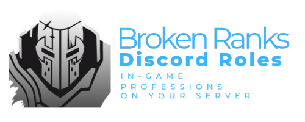
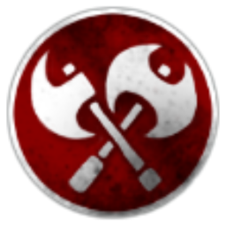
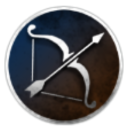
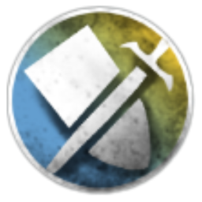

<div align="center">
    
</div>

<div align="center">

[](https://discord.com/)
[](https://brokenranks.com/)
[](https://www.java.com/)
[](https://www.gnu.org/licenses/gpl-3.0)

A powerful Discord bot that brings your Broken Ranks professions into your Discord server! Automatically adds in-game professions as Discord roles and allows players to manage them with simple commands.

</div>

## ✨ Features

- 💬 Easy-to-use `/profession` command for role management
- ⚔️ Supports all Broken Ranks professions
- 🛡️ Secure role management system
- 🌐 Multi-language support:
  - 🇺🇸 English
  - 🇵🇱 Polish

## 💻 Commands

### Managing Professions

```
/profession <in-game profession name>
```

### Available Professions

| Icon                                                                              | Profession |
| --------------------------------------------------------------------------------- | ---------- |
|  | Fire Mage  |
|  | Barbarian  |
|        | Archer     |
|          | Sheed      |
|          | Druid      |
|        | Knight     |
|        | Voodoo     |

## 🚀 Installation Guide

### Prerequisites

- Java 17 or higher
- Gradle
- Discord Bot Token
- Discord Server with administrator permissions

### Setup Steps

1. Clone the repository

```bash
git clone https://github.com/PulseMind/brokenranks-discord-roles.git
```

2. Navigate to the bot directory

```bash
cd ./discord-bot
```

3. Set up configuration

```bash
cp .env.example .env
# Edit .env file with your Discord Bot Token and settings
```

4. Launch the bot

```bash
./gradlew run
```

## 🗺️ Development Roadmap

- [ ] Complete English & Polish language support
- [ ] VPS server deployment
- [ ] Public website launch
- [ ] First public release

## 🤝 Contributing

We welcome contributions! Here's how you can help:

1. Fork the repository
2. Create a descriptive branch for your changes:
   - Features: `feature/add-new-feature`
   - Fixes: `fix/role-sync-issue`
3. Make your changes
4. Push and open a Pull Request

## 📝 License

Licensed under GNU General Public License v3.0 ([LICENSE](LICENSE))

Key points:

- ✅ Commercial use allowed
- ✅ Modification allowed
- ✅ Distribution allowed
- ❗ Source code must be disclosed
- ❗ Same license must be used
- ❗ Changes must be documented

## 📞 Support & Contact

Need help or found a bug?

- Open an [Issue](../../issues)
- Contact: `pulsemindpl` on Discord
- Contact: `contact@pulsemind.pl` with E-Mail

---


<div align="center">
    Made with ❤️ for the Broken Ranks community
</div>
